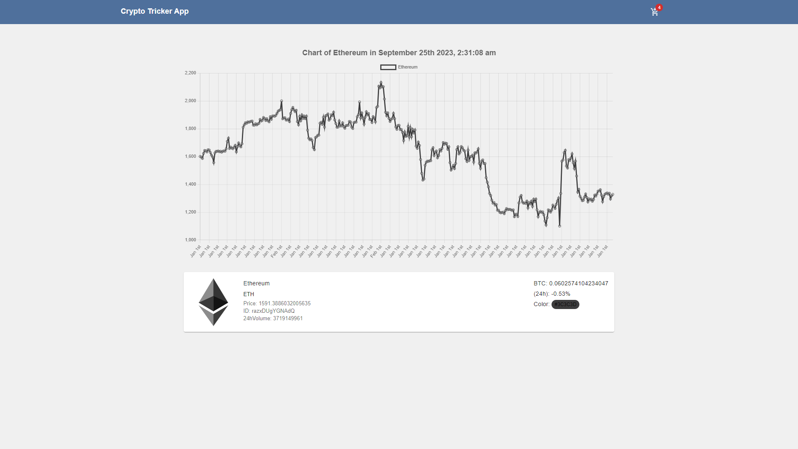

# Crypto tricker





## Crypto tricker app 

- Track the total amount and value of cryptocurrencies in real-time. 
- Track historic transactions, their worth, and destinations or sources

## Features

- Add & Remove favorites
- Search for cryptocurrencies
- Update the prices every minute
- Change cryptocurrency
- Pagination

## Next tasks

- Split the component into a small components
- Add more features to the application
- Create a about page

## Installation & Usage

### Docker

1- Clone the repo

```bash
https://github.com/capo33/react-crypto-tracker
```

2- Run tha app with docker-compose

- in the root directory run the command

```bash
docker compose up
```

### Normal setup

1- Clone the repo

```bash
https://github.com/capo33/react-crypto-tracker
```

2- Install dependencies

- in the root directory run the command

```bash
yarn
```
3- Get an API key 

- from coinranking website

```bash
https://developers.coinranking.com/api/documentation
```
4- Add Env Variables

- Rename the `.env.example` file to `.env` and add the following

```bash
REACT_APP_COINRANKING_API_KEY = your API_KEY
```
 
5- Run the application

```bash
yarn start
```

### Go live

```bash
https://crypto-coins-tracker-react.netlify.app/
```
 
## Tech stack

- [React]
- [Redux]
- [Redux-Toolkit]
- [Typescript]

## Styles

- [Material-UI]
- [Material-Icon]

[React]: https://mui.com/
[Redux]: https://redux.js.org/tutorials/typescript-quick-start/
[Redux-Toolkit]: https://redux-toolkit.js.org/
[Typescript]: https://www.typescriptlang.org/
[Material-UI]: https://mui.com/
[Material-Icon]: https://mui.com/material-ui/material-icons/
